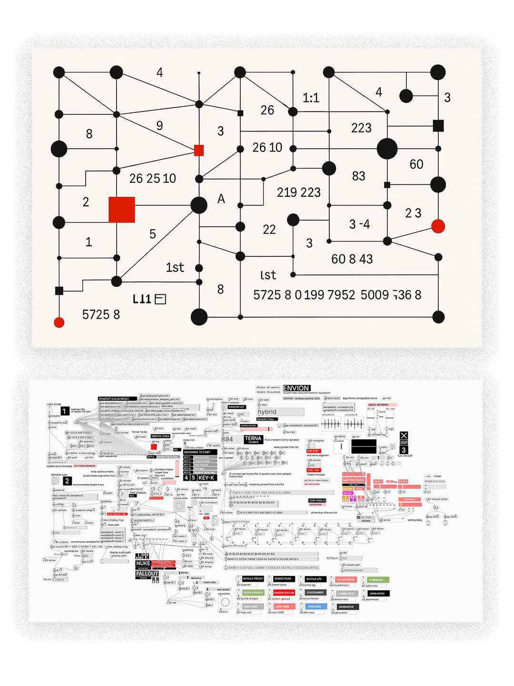
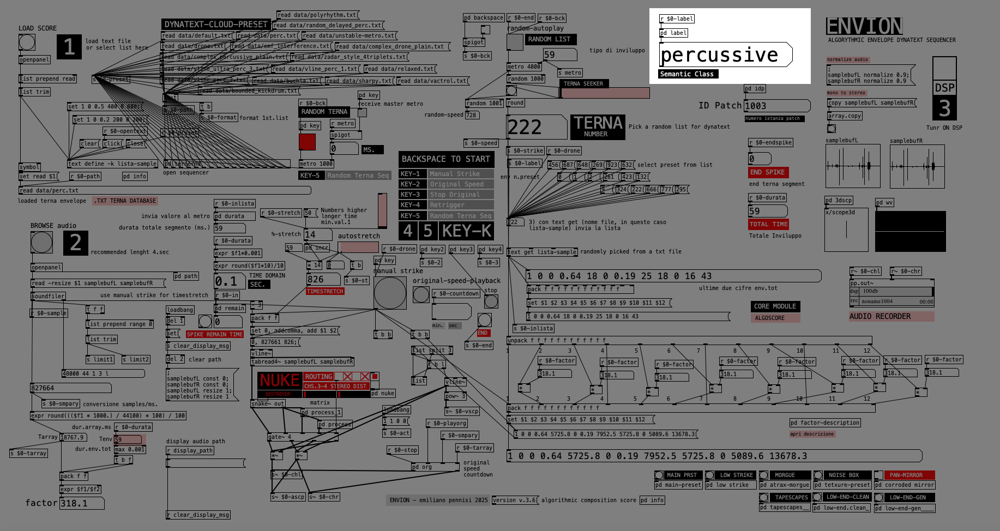

# Envion
Algorithmic Dynatext Envelope Sequencer in Pure Data (Pd) developed by **Emiliano Pennisi 2025**

**Envion** is an ecosystem in Pure Data designed for algorithmic and procedural composition, musique concrète, and experimental sound processing.
It includes tools for slicing, dynamic envelopes, texture generation, and multi-channel management.

For years, I explored different systems for handling envelopes dynamically — starting with software like *Composer Desktop Project*, and later with hardware generators such as **Zadar** in the Eurorack domain.  
I would like to emphasize how fascinating the world of **envelope dynamics** is, and how envelopes can imprint *transformative tonal characteristics* onto sounds. Out of this research, I developed **Envion** as a kind of *gesture generator*.  

I soon realized that the most flexible way to manage **thousands of segments** was to use plain-text databases containing the necessary information. From there, I created the **Dynatext** system.  
At the moment, I am working on formatting textual data from **external APIs**. In this way, **Envion** could become a powerful tool for generating *thousands of random articulations* not only generated from local lists but also from the variable numbers of online APIs.  
For example, by drawing on **stock market data**, **weather information**, or **NASA’s extensive library of APIs** — which are incredibly rich and fascinating. Even *Costar*, the app that calculates natal charts, makes wide use of them.  

## 📖 Documentation

A complete interactive guide (HTML + SVG) is available here:  
[Envion v3.6.1 — Full Documentation](https://www.peamarte.it/env/envion_v3.6.html)

> **Note on Licensing**  
> At the moment, this project is **not** released under a full FOSS license.  
> The plan is to make it **completely open-source** once a few more fixes are in place and the project feels more consolidated.  
>  
> **Why this choice (for now):**  
> - It’s still a very personal and evolving tool.  
> - I’d like to avoid premature forks that could create confusion.  
> - I need time to consolidate ideas, documentation, and artistic direction.  
> - Keeping it non-FOSS (while still free and accessible) lets me decide when and how to open it properly.  
>  
> **Long-term goal:** fully open-source once things are more stable.  

  
*Envion - Plugdata version*

Inside the repository there is also a version tailored for **PlugData.**
It’s worth noting that this version is significantly more performant: unlike Pd-vanilla, where the audio and GUI share the same thread, PlugData (built on JUCE) separates the audio engine from the graphical interface.
This reduces overhead, prevents dropouts when interacting with the patch, and makes real-time processing smoother.
The JUCE-based architecture also improves GUI responsiveness, event handling, and CPU scheduling, resulting in noticeably faster and more stable performance, especially on older machines.

> ### What is?
> **Envion** is an *envelope-first* engine for **Pure Data (Pd)**: it drives the read index of stereo buffers through textual sequences of **triplets** *(value, time, delay)* sent to `vline~`.  
> Each line of a text file represents a complete envelope; switching line means switching gesture.  

▶ Click the image above to watch the video on YouTube

> The system is designed for **musique concrète/acousmatic music**, **sound design**, and **non-metric writing**.  
>  
> **Key idea**  
> Instead of “playing” files, Envion **writes trajectories** on them through numeric envelopes (*dynatext*).  
> This enables **hyper-articulated hits**, **slow morphs**, **irregular internal delays**, and **pseudo-organic behaviors**.  
>  
> At its core, Envion adds an **algorithmic layer** that keeps the envelope and the sample tightly coupled.  
> This ensures that temporal gestures and sonic material remain bound together, preserving coherence while still allowing complex, generative transformations.  

IMPORTANT! This Pd patch depends on the following external libraries: Cyclone | gge | ceammc | else | symplex~ (for 3D scope) | audiolab
[First step on Envion (youtube clip)](https://www.youtube.com/watch?v=BiTsPTQfgCY&feature=youtu.be)

[Deep HTML / SVG Guide here: ](https://www.peamarte.it/env/envion_v3.6.html)

---

# Using Envion

As a **procedural environment**, in most cases it is sufficient to **load a sample**, record the output for several minutes, and then select the most interesting portions of the generated audio.

1. Load a sample into the main buffer.
2. Enable **Random Terna** (checkbox below the Dynatext Cloud).
3. Enable **Random List** (central checkbox).
4. Record the output for several minutes.
5. Select the most significant sections of the recorded audio.

This approach highlights Envion’s nature: it is not about “playing” directly, but about **generating emergent sonic material** from which fragments can be extracted for composition.

NOTE: When loading material with **high headroom** (low volume), you can use the **array normalization** utility located in the top-left corner.  
If instead you load **mono audio material**, there is also a **Mono → Stereo** function in the top-right corner.  
This function creates a small loop and copies the data from the **left array** into the **right array**.

> Ultra-stereo material is recommended for this kind of application.  
> When loading and mirroring mono material, activate **Nuke** on alternate channels of the matrix mixer to emphasize differences between left and right arrays, **widening the stereo field**.

---

# First Steps with included audio materials

To start experimenting, try loading the file:

`/audio/env_0001.wav`

This reel was created specifically for Envion using my **modular synthesizers** (Orthogonal Devices **ER-301**, **Morphagene**, and several **Low Pass Gates**).  
It was then **reamped** — played back through speakers and re-recorded in the room — to capture the **original ambient nuances** of the space.  

The result is a material that embodies a **contrast**:  
- **Surreal gestures** generated by modular synthesis.  
- Immersed within a **real acoustic environment** that imprints its own depth and imperfections.  

This interplay between the **synthetic and the real**, between **algorithmic articulation** and **spatial resonance**, is at the core of Envion’s aesthetic exploration.

# Procedural Randomization Automation 

By enabling both checkboxes, Envion activates a **procedural randomization** process that automatically draws from **19,000 pre-defined triplets** and applies the X factor to each segment of the terna automatically, thereby imposing its own time-stretch and creating the sonic gesture.

* **Random Terna**: continuously loads text files from the `/data` folder (each file contains about 1,000 envelopes/triplets).
* **Random List**: randomly selects one of the 1,000 available lists.

This mechanism allows Envion to combine automatic loading and random selection, producing an ever-changing and potentially infinite stream of events.

The patch may look **intimidating** at first, but it is intentionally left **“alive”** (with formulas and functions visible) to encourage **exploration**.
Once you become familiar with the few basic operations (**keys 1–5** and the **space bar**, the latter enabled via a flag), in most cases it is best to **record the output**: if a particular articulation catches your ear during playback, it will be difficult to reproduce the exact same combination.

Even though many operations seem **repeatable** (such as manually selecting a *terna* index from the list or triggering events by hand), the real nuances mainly emerge during the **automatic phase**, where **non-deterministic connections** between lists/terne take place — a sort of **unpredictable snapshot**.

At other times, depending on the **source material**, envelopes may generate **non-zero-cross points** or **glitches**. Yet this is part of the charm: when the program runs in **random mode** — especially if you alternate gestures (**keys 1–5** and the **space bar**) — it becomes possible to capture **subtle variations** and **micro-articulations** that the system brings to life.

## Stereo Behavior and Enhanced aggression

The **Nuke** module processes the **left and right channels with slight differences** in the filter and clipping stages.  
These micro-variations introduce **phase shifts** and **asymmetries** between L and R, resulting in:

- **Stereo widening**: the left and right outputs are no longer exact copies, creating a broader spatial image.  
- **Perceptual instability**: small discrepancies between L+R cause the sound to feel more alive and shifting in space.  
- **Enhanced aggression**: distortion artifacts differ across channels, producing a **wider, noisier stereo field**.

  
*Distortion/overload utility snapshot*

This design choice makes Nuke not only a distortion stage but also a **stereo expander through destruction**.  
The contrast between **similar but non-identical processing** of L and R is what gives the module its strong sense of spatial depth.

## 📂 Project structure

- `Envion_v3.6.1.pd` → main patch  
- `audio/` → test samples and audio files 
- `data/` → data terna and presets for slicing/algorithms  
- `html-guide/` → guides and documentation (also in HTML/CSS format)  

---

## The concept of *Terne*

One of the central elements of **Envion** is the use of *terne* (triplets of numerical values).  
Each terna defines the behavior of a sound fragment through three main parameters:

1. **Duration** – relative or absolute time of the event (in ms or scaling factor).  
2. **Amplitude** – the signal level, which can be constant or shaped by an envelope.  
3. **Offset / Position** – the reading point or starting position of the fragment within the sample.

### Examples of terne
<pre>
0.452  80  0     ; → 452 ms duration, amplitude 80, offset at start of sample
0.210  45  600   ; → 210 ms duration, amplitude 45, offset 600 ms into the sample
0.879  100 1280  ; → 879 ms duration, full amplitude, offset 1280 ms
</pre>

# Semantic Class – List Validation and Categorization

The patch `duration_flag_800.pd` implements a basic **semantic check** for incoming lists (vline-style). It ensures structural validity and assigns each list to a category before it is passed on.

# Step-by-step logic

1. **Input (**`inlet`**)** A list in `vline~` format enters the patch (usually a triplet: *duration – amplitude – offset*).
2. **Length check (**`list length`**)**
   * The list must contain **at least 3 elements**.
   * If it has fewer than 3 → it is flagged as `list invalid`.
3. **Splitting and unpacking**
   * The list is split and the first three values are extracted (`unpack f f f`).
   * The **first element** is interpreted as *duration*.
4. **Duration test (**`moses 500`**)**
   * If duration **< 500 ms**, the list is classified as `list percussive`.
   * If duration **≥ 500 ms**, it is classified as `list hybrid`.
5. **Routing**
   * Invalid lists are discarded.
   * Valid lists are semantically tagged as *percussive* or *hybrid* and then sent to the `outlet`.

# In practice

This patch acts as a **semantic filter**:

* It first checks whether a list is **structurally valid** (minimum 3 items).
* Then it applies a **musical classification** based on duration: short events are *percussive*, longer ones are *hybrid*.

This guarantees that Envion only processes clean, meaningful lists and can route them according to their temporal behavior.

## Quick Start

1. **Load a list** from **Dynatext Cloud** (or select a local `.txt` in `data/`).  
2. **Browse a sample** (WAV) and assign it as the playback buffer.  
3. **Turn on DSP** and explore.

- Use the **manual triggers** and sliders to test sequences.  
- Adjust the **stretch factor** to compress/expand time.  
- Try the **ready-made presets** (bottom area).  

**Timebase & $0-factor**  
The timebase module retrieves the buffer duration (samples → milliseconds), exposes it as **$0-durata**, and calculates **$0-factor** for the global stretch of envelopes.

**TYPICAL CONVERSIONS**

    // from samples to milliseconds (44.1 kHz)
    expr round((($f1 * 1000.) / 44100) * 100) / 100
    

* **$0-factor** applies to times of each segment.
* Not mandatory when using *terne* as parameter modulations (e.g., FM resonance, filter index, temporal stretching).

**Original-speed playback:**  
`0, <array_size> <durata_ms>` → scans the entire buffer in **durata\_ms** at constant speed.

**WORKFLOW**

1. **Load a sample** → `openpanel ~ soundfiler` into **sampletabL/R**. If mono, use *Mono→Stereo* (array copy L→R).
2. **Load an envelope library** → `text define/get`. Each line = one *terna*. Select or randomize.
3. **Play** → via autoplay or manual keys: **KEY1–4** (strike, original-speed, stop, retrigger).
4. **Record** → from block **AUDIO RECORDER**.

**USEFUL PRESETS (IDEAS)**

# Lists of Terne (1000 envelopes each - total 19k list)

* **default.txt** – basic, neutral list, useful as a starting point.
* **perc.txt** – percussive envelopes with fast attacks and short decays.
* **vline\_perc\_1.txt / vline\_perc\_2.txt / vline\_ultra\_perc\_3.txt** – percussive variants generated via `vline~`, from softer (1) to more extreme/fast (3).
* **zadar\_style\_4triplets.txt** – complex envelopes inspired by the *Zadar* generator, with four-way triplet structures.
* **complex\_drone\_plain.txt** – long, static envelopes designed for drones.
* **complex\_percussive\_plain.txt** – articulated, rhythmical envelopes with irregular variations.
* **emf\_interference.txt** – patterns inspired by electromagnetic interference, with glitchy and fragmented shapes.
* **drone.txt** – very extended, continuous envelopes for static layered textures.
* **unstable-metro.txt** – “unstable metronome” sequences, irregular timing with micro-variations.
* **buchla.txt** – organic, *West Coast*\-style envelopes, fluid and unpredictable curves.
* **sharpy.txt** – sharp envelopes with strong transients.
* **relaxed.txt** – smooth envelopes with slower times and softened curves.
* **random\_delayed\_perc.txt** – percussive hits with random delays, creating temporal irregularities.
* **vactrol.txt** – envelopes emulating a *vactrol low pass gate*, with natural attack/decay response.
* **polyrhythm.txt** – multi-layered, offset patterns generating polyrhythmic articulations.
* **bounded\_kickdrum.txt** – envelopes constrained to kick-drum ranges, punchy with short sustain.
* **terne\_1000\_fadeout.txt** – 1000 terne with progressive fadeout, ideal for dissolving structures.

**LIBRARY FORMATTING**

    1 0.0 0.58 19 0.8 22 29 1 25 41;
    0.7 120 0.0 38 80;
    

* Line 1 = **4-segment envelope**
* Line 2 = **2-segment envelope** Avoid all-zero lines (silent)

**AUTOPLAY & MANUAL PLAYER**

* **Autoplay**: a metro drives `text get`; last strike duration can trigger next step (*END* listener).
* **Manual**:
   * **KEY1** = strike
   * **KEY2** = original-speed
   * **KEY3** = stop
   * **KEY4** = retrigger

*Smart concatenation*: internal delays in *terne* allow irregular patterns without reprogramming the metro.

**PLAYBACK ENGINE**

* `tabread4~ sampletabL/R` → interpolated 4-point reading, indexed by **vline\~**
* `*~ / pow~` → amp control (envelope) + optional shaping
* `snake~` → stereo/multichannel routing
* `safety` → `clip~` adds headroom to avoid clipping

**Note:** `tabread4~` never stops. It runs until index=0 or out of buffer.  
For immediate stop: send **clear/stop** to `vline~`, or drop amp to 0.

**OUTPUT & RECORDER**

* Main out → **pd out\~** (replace with `dac~`)
* **Normalization** (utility UI) before printing
* **Recorder**: internal block with **rec/stop** buttons

# Tricks & Best Practices

* **Library hygiene**: one envelope per line; always close with `;`. Avoid zero times anywhere.  
* **Headroom**: add `clip~` after the amplitude multiplier if you use `pow~` or boosting.  
* **Stagger stereo**: send the same envelope to L/R but offset *delays* by a few ms for micro-spatial instability.  
* **Param-mod**: use terne as *control-rate* (via `vline` + `snapshot~` or directly `vline~ → *~`) for resonance/FM index. `$0-factor` is optional.  
* **Original-speed**: build messages “0, size duration” for linear scans; useful as timbral reference.  
* **Debug**: print the raw line, then the list of segments; check that the sum of *time+delay* does not exceed sync expectations.  

---

# Quick Play & Algorithmic Drum Machine

Envion can also be approached in a very **hands-on** way, without diving into all the procedural automation.

## Manual Strike Mode
- Load any list from the **Dynatext Cloud**.
- Assign a sample (short percussive ones work best).
- Use **KEY-1 (Manual Strike)** to trigger individual gestures.  
Each line of the list becomes a distinct hit: quick to explore, immediate to hear.

This simple workflow turns Envion into an **algorithmic drum machine**: by browsing different lists and striking manually, you can generate unique **percussive articulations** and irregular rhythms.

## Tips & Tricks
* Combine **short samples** (kicks, snares, metallic hits) with **percussive lists** (`perc.txt`, `random_delayed_perc.txt`) for rhythmic patterns.
* Try **drone or long lists** on short samples: unexpected stutters and stretched hits emerge.
* Map envelopes to **parameter modulation** (filters, FM index) instead of playback for complex timbres.
* Alternate between **manual strike** and **autoplay** to balance **control** and **emergence**.
* For **drum-like grooves**, use Random List + Random Terna but limit the sample length to ≤ 500 ms.

This way, Envion can be both a **tool for deep algorithmic exploration** and a **playful instrument** for instant, raw experimentation.

---

# FAQ

## Is a line with just one terna “valid”?  
Yes. **One line = one envelope**. With a single terna you get a one-step envelope. Multiple terne on the same line ⇒ multi-segment.  

## I want to use 12 terne in one line. Do I need to change `list split 3`?  
No. `list split 3` is correct: it iterates groups of three values. Instead, extend the receiving side (e.g. `unpack` to 36 floats) or implement a dynamic parser with `[until]` that sends each terna to a subpatch for accumulation into `vline~`.  

## Sometimes no sound comes out with certain lists of terne. Why?  
* Zero times (or very long *delays*) ⇒ apparent silence.  
* *target* = 0 in all segments ⇒ zero amplitude.  
* Formatting errors (missing `;`, commas instead of dots, broken lines).  
* `$0-factor` too small/large ⇒ “micro” or “glacial” envelopes.  
* Out-of-buffer index (wrong messages to `vline~` for array scanning).  

**Procedure:** print the line → check triplets → verify sum of *time+delay* → try without `$0-factor` → try “original-speed”.  

## How do I immediately stop playback?  
Send `stop` or `clear` to `vline~` and attenuate with `*~ 0`.  
*tabread4~* follows the index: if the index doesn’t move and amp = 0, you hear nothing.  

## What does the “4” mean in `tabread4~`?  
It’s **4-point interpolation** (cubic). Improves quality when the index moves at non-integer speeds or oversampling.  

## Difference between `line`, `line~` and `vline~`?  
* `line`: control-rate ramp.  
* `line~`: audio-rate ramp, but only one segment per message.  
* `vline~`: audio-rate with a **sequence** of segments, each with its own *delay*.  

## Can I use terne to modulate filters/FM instead of audio?  
Yes. In that case map *targets* to the parameter’s range. `$0-factor` is only needed if you want to scale times; otherwise ignore it.  

## What input file “quality” is needed?  
44.1/48 kHz is more than enough; avoid peaks at 0 dBFS. Leave 3–6 dB of headroom for shaping.  

## How do I manage huge libraries (≈10k envelopes)?  
After preparing the text files, use the browse txt file option to load them. Then navigate with a numeric index or trigger a random selection button. Keep files thematic for coherent families. Use a numeric index for navigation and a button for random selection. Keep files “thematic” for coherent families.  

---

v.3.6.1 last update domenica 22 settembre / 22.29
